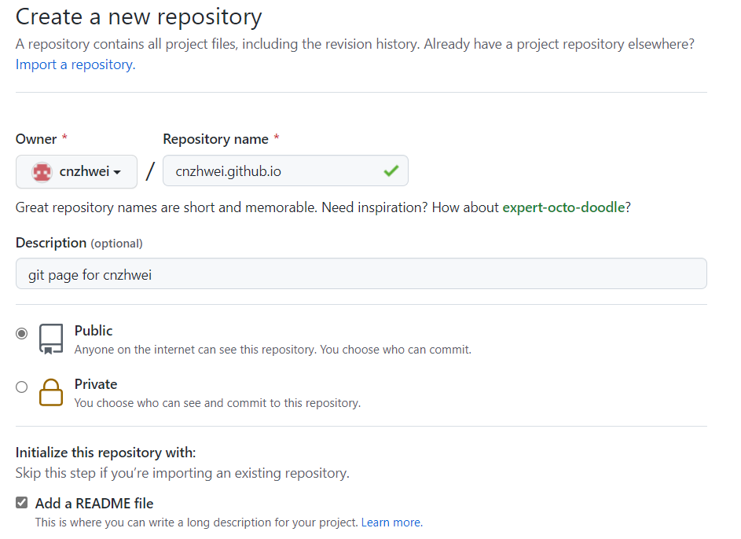
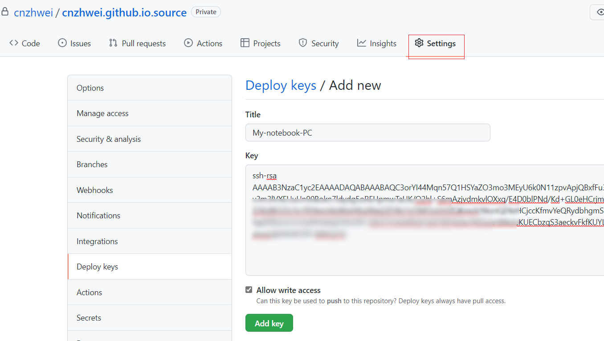
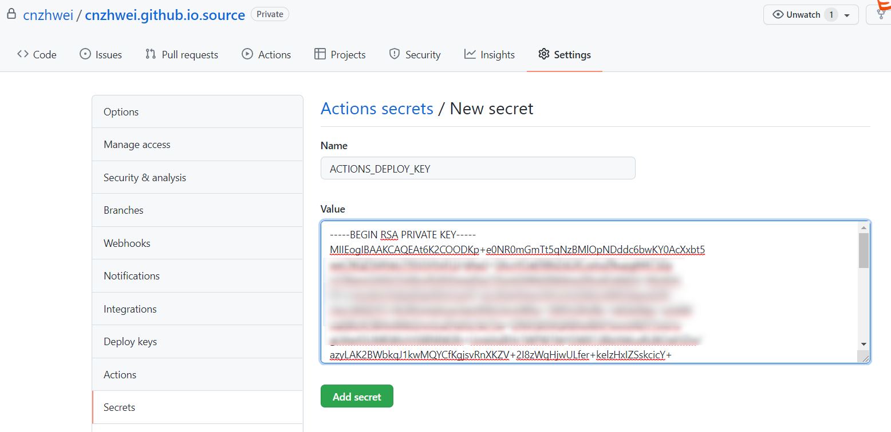
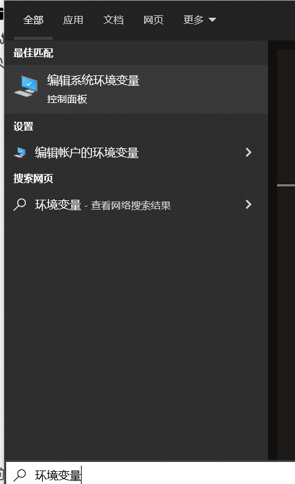
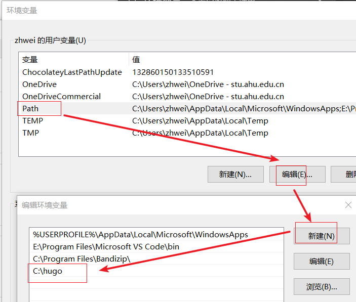
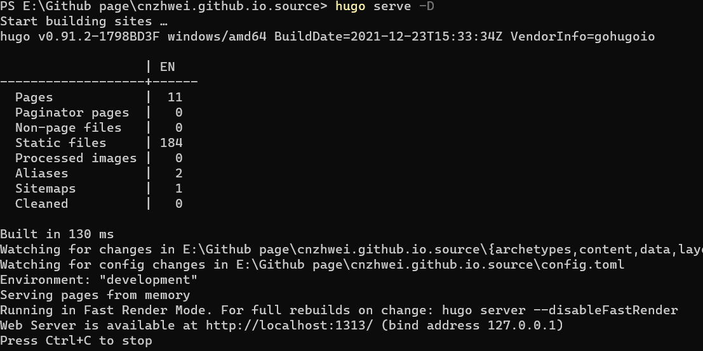
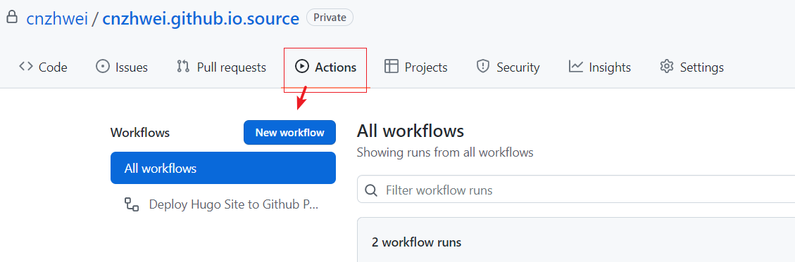
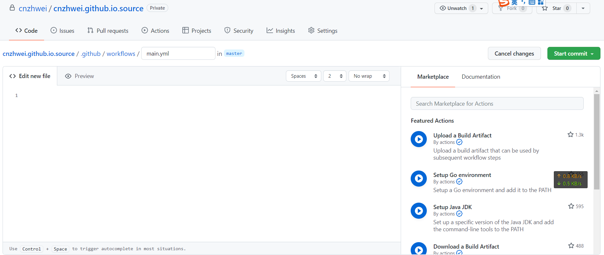

## 1. 新建page项目

打开网址：[https://github.com/new](https://github.com/new)

新建两个项目：

- `cnzhwei.github.io` 用于page网站展示，属性为public
- `cnzhwei.github.io.source` 用于存放网站源markdown文件，属性为private


下图为`cnzhwei.github.io`创建截图：




### 1.1 加入公钥

将本地公钥（一般位置在：`C:\Users\``**[yourname]**``\.ssh\id_rsa.pub`）的内容添加进仓库中（没有公钥可百度搜索：`git生成公钥`），两个仓库都添加

`Settings `→ `Deploy keys` →`Add new`



### 1.2 添加密钥

将本地公钥（一般位置在：`C:\Users\``**[yourname]**``\.ssh\id_rsa`）的内容添加进仓库中（没有公钥可百度搜索：`git生成公钥`），只添加source仓库

`Settings `→ `Secrets `→`New`



### 1.3 下载项目到本地

```PowerShell
git clone git@github.com:cnzhwei/cnzhwei.github.io.source.git
git clone git@github.com:cnzhwei/cnzhwei.github.io.git

```


## 2. 通过hugo搭建

hugo是一个基于Go的博客搭建系统

### 2.1 Windows安装hugo

2.1.1 下载二进制包，在hugo的release页面：[https://github.com/gohugoio/hugo/releases/download/v0.91.2/hugo_0.91.2_Windows-64bit.zip](https://github.com/gohugoio/hugo/releases/download/v0.91.2/hugo_0.91.2_Windows-64bit.zip)

2.1.2 解压文件到C:/hugo

2.1.3 添加环境变量

开始菜单搜索“环境变量”，然后点击“编辑环境变量”



然后编辑`Path`→`新建`




### 2.2 新建页面

```PowerShell
#进入目录
cd cnzhwei.github.io.source

# 创建站点
hugo new site . --force


```


## 3. 内容写作

```PowerShell
# 新建一篇文章
hugo new posts/my-first-page.md

# 本地开启服务
hugo serve -D
```




### 3.1 修改文章内容

修改`posts/my-first-page.md`

```Markdown
---
title: "My First Post"
date: 2022-01-07T16:11:53+08:00
draft: false
---

my first pages

```


- title：文章标题
- draft：是否为草稿，如果为true，则不会发布在github page网页


## 4. 发布

进入source仓库，点击`actions`，然后点击`new workflow`



然后新建一个workflow



添加如下内容，填完完成后，点击左上角绿色的`Start commit`

```YAML
name: Deploy Hugo Site to Github Pages on Master Branch

on:
  push:
    branches:
      - master

jobs:
  build-deploy:
    runs-on: ubuntu-18.04
    steps:
      - uses: actions/checkout@v1  # v2 does not have submodules option now
       # with:
       #   submodules: true

      - name: Setup Hugo
        uses: peaceiris/actions-hugo@v2
        with:
          hugo-version: '0.62.2'
          # extended: true

      - name: Build
        run: hugo --minify

      - name: Deploy
        uses: peaceiris/actions-gh-pages@v3
        with:
          deploy_key: ${{ secrets.ACTIONS_DEPLOY_KEY }} # 这里的 ACTIONS_DEPLOY_KEY 则是上面设置 Private Key的变量名
          external_repository: cnzhwei/cnzhwei.github.io
          publish_dir: "./public/"
          keep_files: true # remove existing files
          publish_branch: master  # deploying branch
          commit_message: ${{ github.event.head_commit.message }}
```


然后本地仓库先拉取一次远程内容，避免分支冲突

```text
git pull
```


### 发布内容

通过git 推到远程，即可触发workflow，然后就会更新github page

```text
git add -A
git commot -m "完成配置，生成第一个网页"
git push -u master origin
```


